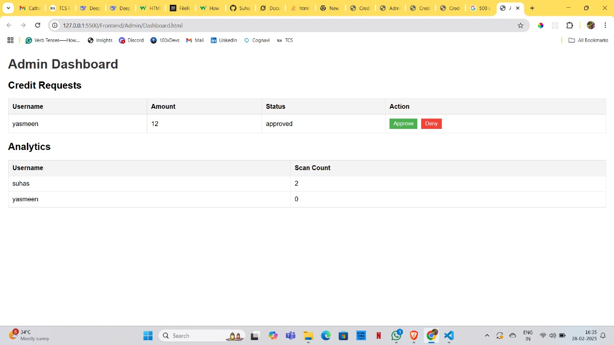

### Credit-Based Document Scanning System

### Tech stack used: 

1. Frontend(HTML , CSS , JS)
2. Backend(Node.js)
3. Database(sqlite3)

### Features Implemented

1. User Authentication(using JWT)
2. Document upload and credit deduction
3. Credit request for the admin
4. Admin able to approve the credits request
5. Analytics 

### Admin side dashboard

### Sign up page

### Sign in Page

        